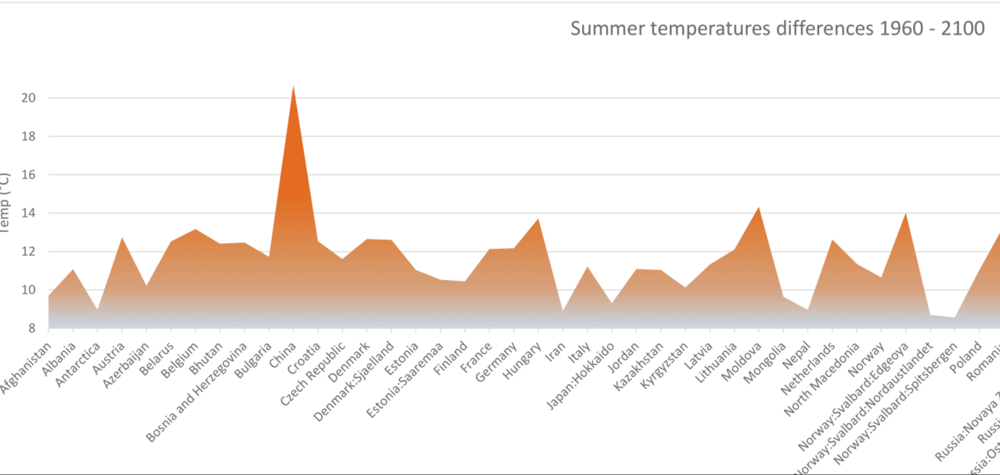
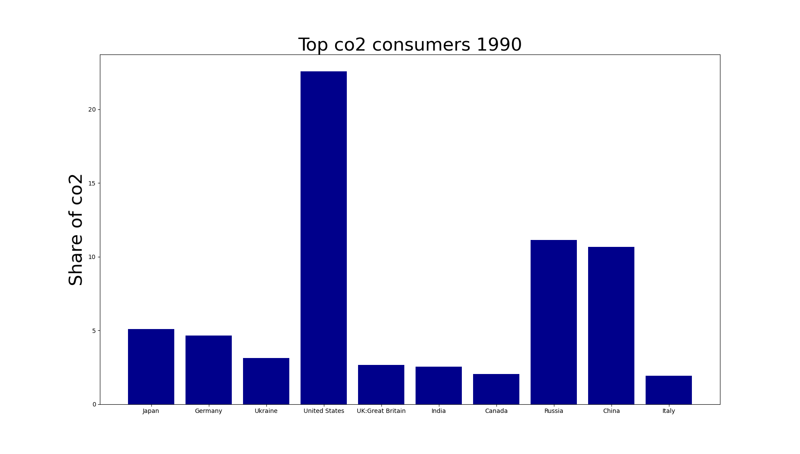
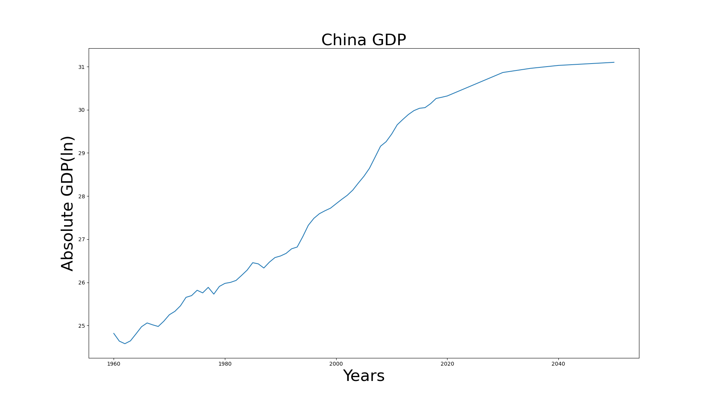
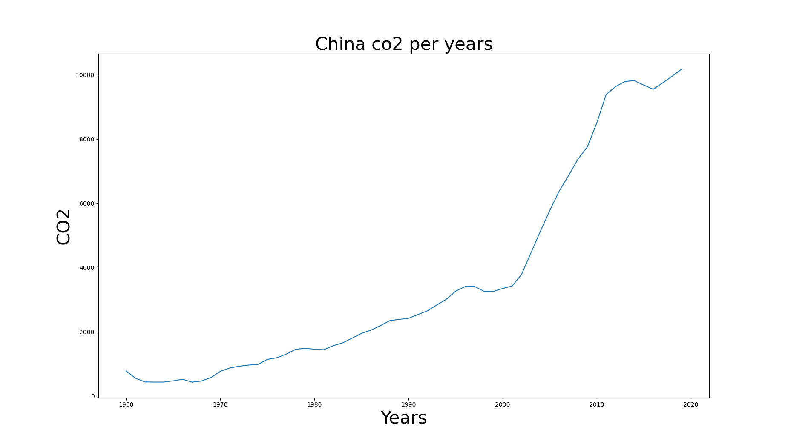
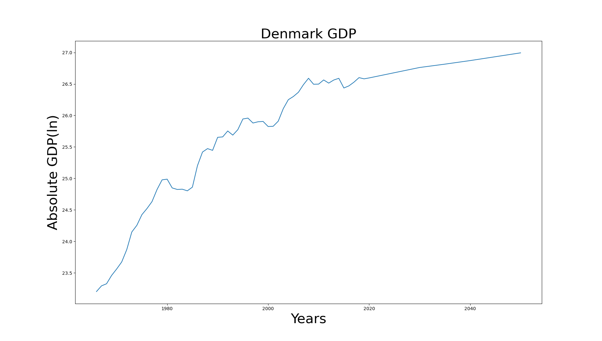
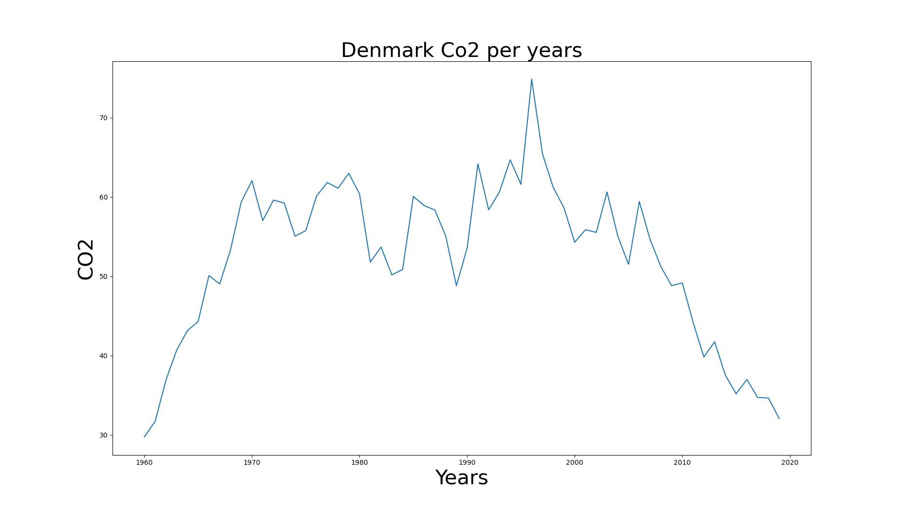

# Data-4-Good-Challenge

## Introduction

This repository contains source code and report used for Data 4 Good Challenge 2021 in Leuven, Belgium. Climate on Earth has through years become one of the most important topics in the world. Global warming, water of not enough quality to be drank, tornados etc. all of these things are creating huge human, economic and political damage. 

    

## Our approach

In this competition we tried to solve the problem by focusing on the CO2 consumption. We managed to extract information about which companies are the largest pollutants and base large part of its wealth on industrial processing and concluded they are China, Russia and USA. 

    

Here especially big problem represents China because it is the only one that is even increasing CO2 emission and this can be easily seen from plot below.

China GDP        |  China CO2 consumption
:-------------------------:|:-------------------------:
   |   

Our way out is Denmark. Denmark is very wealthy country that bases its success on food processing, agriculture, fishing, wind farms and bio fuels. It is very poor in natural resources, especially when compared to a country like Russia, but still manages to import only 12% of its energy. It also expexts to be completely self-sufficient until 2050. 

Denmark GDP           |  Denmark industry money making
:-------------------------:|:-------------------------:
   |   

## Conclusion

We can hope that terms agreed in Paris agreement will be met and that all countries will be able to follow positive examples like Denmark.

1.   Decrease reliance on non-green industry or industries in general
2.   Support green technology
3.   Adapt some industrial model like Denmark
4.   #SwitchToGreen

**Team**: Andi Škrgat, Pawel Batorski, Amit Singh Bhati, Pankaj Singla
